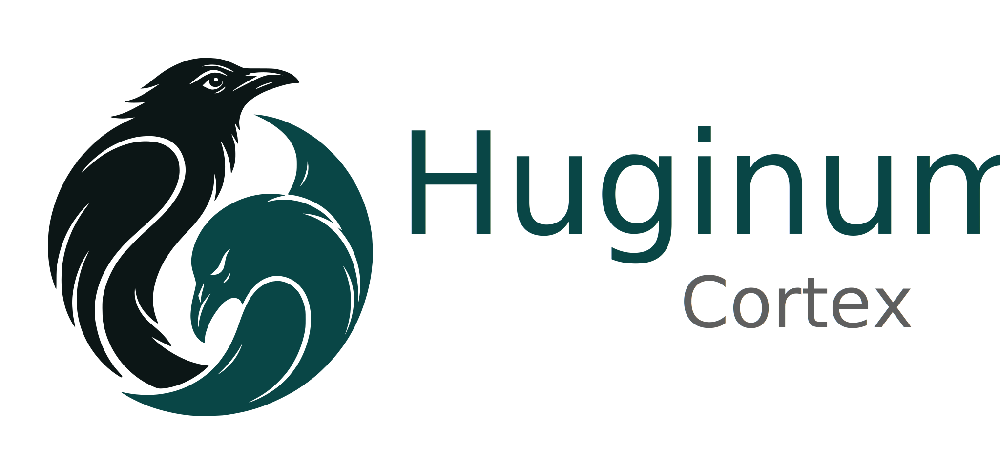

<p align="center">
  
</p>

# Huginum Cortex - Local Agentic Development Platform

Cortex is Huginum's local agentic development platform.

The first implementation is a standalone desktop terminal built with Tauri, React, and libghostty-vt. It establishes the local terminal foundation Cortex will build on for agentic development workflows.

## Development

```sh
npm install
npm run tauri:dev
```

## Build and install (macOS)

Prerequisites: a recent [Node.js](https://nodejs.org/), the [Rust toolchain](https://rustup.rs/), and [Zig](https://ziglang.org/) (used to build the libghostty-vt WebAssembly module).

Build a release `.app` bundle:

```sh
npm install
npm run tauri:build
```

The bundle is written to:

```
src-tauri/target/release/bundle/macos/Cortex.app
```

Copy it into your Applications folder:

```sh
cp -R src-tauri/target/release/bundle/macos/Cortex.app /Applications/
```

The build is unsigned, so the first launch is blocked by Gatekeeper. Either right-click the app and choose **Open**, or clear the quarantine attribute:

```sh
xattr -dr com.apple.quarantine /Applications/Cortex.app
```

## Checks

```sh
npm run build
npm run ghostty:verify
npm run docs:build
```

Brand assets live in `public/brand/` for the app and `docs/modules/user/assets/images/brand/` for Antora.
